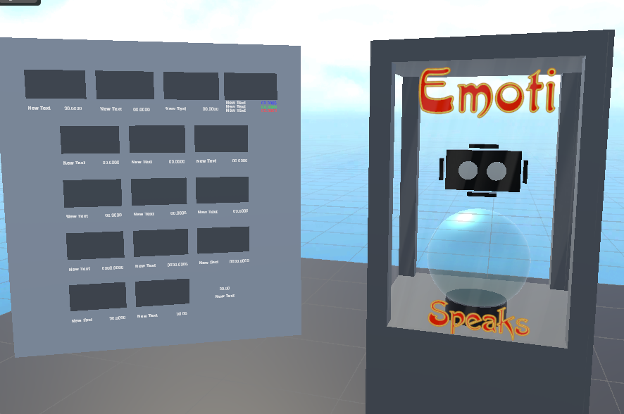
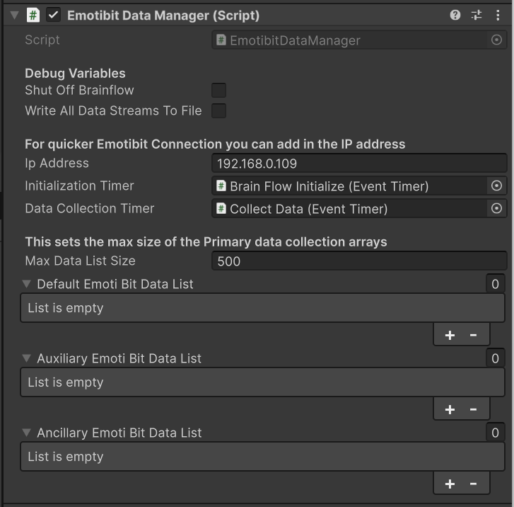
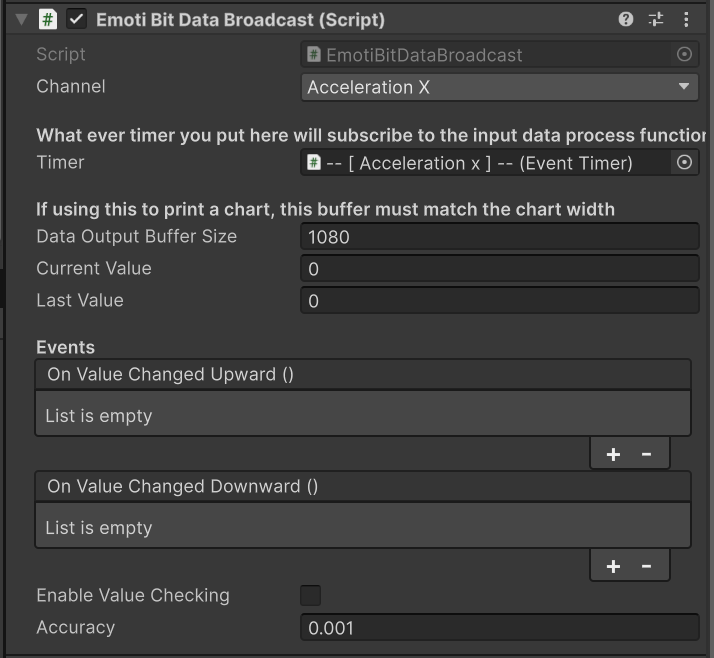
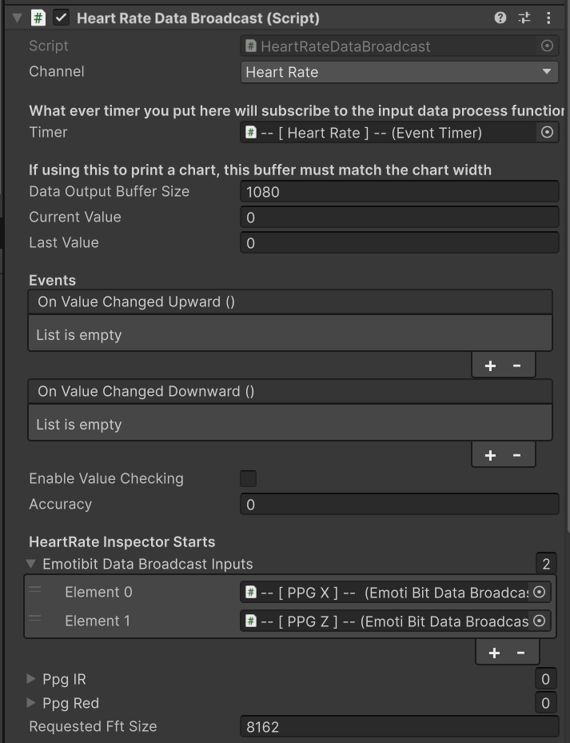
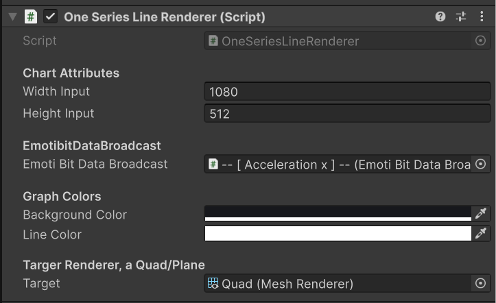
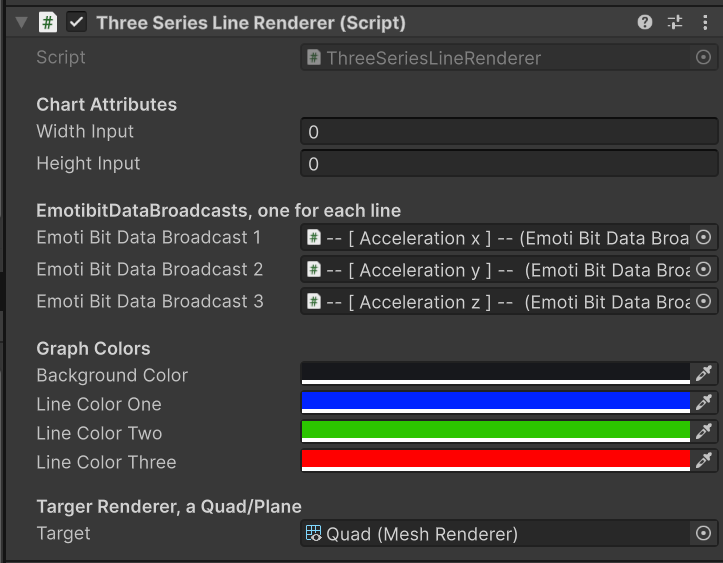
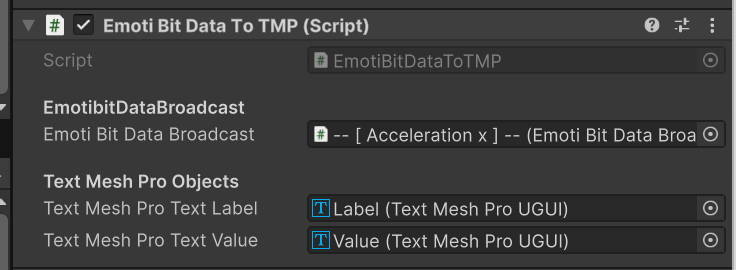

# 🧠 EmotiBit Plugin for Unity

## Table of Contents
- [Overview](#overview)
- [Features](#features)
- [Use Cases](#use-cases)
- [Learn More](#learn-more)
- [Installation & Setup](#installation--setup)
- [Core Components](#core-components)
- [Visualization](#visualization)
- [UI Integration](#ui-integration)
- [Example Flow](#example-flow)

---

## Overview
The **EmotiBit Unity Plugin** provides an **event-driven framework** for streaming, processing, and visualizing **physiological signals** from the EmotiBit sensor board inside **Unity**.

Built on top of **BrainFlow**, the plugin handles low-level device communication and delivers data as strongly-typed Unity-friendly structures that are easy to subscribe to and integrate into interactive projects.

---

## Features

### BrainFlow Integration
- Connects directly to an EmotiBit board via BrainFlow, automatically handling setup, streaming, and cleanup.
- Data is converted into custom data types for straightforward use inside Unity scripts.

### EmotiBit DataBroadcaster
- The central component that pulls data from the EmotiBit source and publishes it through flexible broadcasters.
- Buffers incoming values at Unity’s `FixedUpdate` rate.
- Exposes events that trigger when values are rising or falling, allowing game logic, interactions, or feedback systems to react to physiological signals.
- Multiple broadcaster types supported, making it simple to extend or customize how data is exposed.

### Visualization Tools
- **Texture Creator**: Render real-time physiological signals as single-series or three-series line charts.
- **Automatic Text Updater**: Display live values as text in the Unity UI with no extra coding required.

### Extensible Design
- Example: A `HeartRateDataBroadcast` is included as a derivative of `EmotiBitDataBroadcast`. This shows how new broadcasters can be built to integrate seamlessly with the chart and text components.

### Event-Driven API
- No polling or manual threading required—just subscribe to events like `OnValueUp` or `OnValueDown` and respond to signals as they happen.

---

## Use Cases
- Biofeedback-driven gameplay and experiences.

---

## Learn More
- [EmotiBit Official Site](https://www.emotibit.com)
- [BrainFlow Documentation](https://brainflow.org)

---

## Installation & Setup

To run the EmotiBit Unity Plugin, install a few dependencies first. Follow the steps below to set up your Unity project and get connected to your EmotiBit.

### 1. Install Unity
If you don’t already have Unity installed, download the Unity Hub.  [Download Unity Hub](https://unity.com/download).

> We recommend installing the latest Long Term Support (LTS) version for maximum stability.

### 2. Install NuGet for Unity
NuGet is a package manager that lets us easily bring in external libraries like BrainFlow.

1. Download the latest release of **NuGetForUnity**.
2. In Unity, open your project and go to:
   ```
   Project Window → Right-Click → Import Package → Custom Package
   ```
3. Select the NuGet Unity package you downloaded.
4. Once installed, you’ll see a **NuGet** menu appear in the Unity toolbar.


### 3. Install BrainFlow via NuGet
BrainFlow provides the communication layer between Unity and your EmotiBit.

1. In Unity, go to the top menu bar and select:
   ```
   NuGet → Manage NuGet Packages
   ```
2. Search for **BrainFlow**.
3. Install the latest version.

> Optional reference: BrainFlow Integration with Game Engines

### 4. Install TextMesh Pro
TextMesh Pro is required for displaying live sensor values as text inside Unity.

- In Unity, go to:
  ```
  Window → TextMeshPro → Import TMP Essential Resources
  ```
- Unity will import the fonts and shaders needed.

### 5. Install the EmotiBit Plugin
1. Download the [EmotiBit Plugin package](https://github.com/EmotiBit/EmotiBit_Accessory_Apps/releases/tag/EmotiBitUnityPlugin).
2. In Unity, go to:
   ```
   Project Window → Right-Click → Import Package → Custom Package
   ```
3. Select the EmotiBit package file and import it.

### 6. Run the Demo Scene
To verify everything is working:

1. Open the `EmotiBitSpeaks` scene included with the plugin.
2. Connect your EmotiBit device.
3. Press **Play** in the Unity Editor.

✅ If everything is set up correctly, you’ll see a message in the Console:
```
Manager initialized
```

At this point, your EmotiBit is streaming data into Unity!



---

## Core Components

### EmotiBitDataManager
The central bridge between the EmotiBit hardware and Unity.

- Initializes and manages BrainFlow sessions.
- Collects data from all three BrainFlow presets:
  - **Default** → acceleration, gyroscope, magnetometer, timestamps, markers.
  - **Auxiliary** → PPG channels (IR, Red, Green).
  - **Ancillary** → EDA, temperature, markers.
- Converts raw BrainFlow arrays into Unity-friendly classes:
  - `DefaultEmotiBitData`
  - `AuxiliaryEmotiBitData`
  - `AncillaryEmotiBitData`
- Maintains rolling buffers of parsed data with configurable max size.
- Supports optional CSV logging and debug printouts.
- Ensures safe cleanup of BrainFlow sessions when destroyed.


### EmotiBitDataBroadcast
Event-driven broadcaster for a single channel (e.g., Accel X, Gyro Z, EDA).

- Subscribes to `EmotiBitDataManager` and pulls one channel’s samples.
- Maintains a rolling buffer sized to match chart widths or analysis needs.
- Exposes `currentValue` and `lastValue`.
- Raises UnityEvents (`OnValueChangedUpward`, `OnValueChangedDownward`) with configurable thresholds.
- Designed to plug directly into visualization (charts, TMP) or trigger gameplay/UI logic.


### HeartRateDataBroadcast
Example derived broadcaster.

- Consumes IR + Red PPG channels from two `EmotiBitDataBroadcast` inputs.
- Maintains rolling PPG arrays.
- Runs detrending, bandpass (0.7–4 Hz), and FFT via BrainFlow’s `DataFilter.get_heart_rate`.
- Outputs a heart rate BPM estimate to its inherited `dataOutputBuffer`.
- Validates inputs, clamps ranges, and surfaces error messages.


### EmotiBitBoard Descriptions & Data Classes
- `EmotiBitBoardDefaultDescription`, `EmotiBitBoardAuxiliaryDescription`, `EmotiBitBoardAncillaryDescription`  
  → Static channel maps and metadata for each BrainFlow preset (sampling rate, index layout).
- Data containers (`DefaultEmotiBitData`, `AuxiliaryEmotiBitData`, `AncillaryEmotiBitData`)  
  → Strongly-typed structs holding parsed values, timestamps, markers, and package numbers.


### EventTimer
- Lightweight event-driven timer that ticks on Unity’s `FixedUpdate`.
- Configure duration, offset, and repeat mode.
- Auto-start at `Awake` or after an offset.
- Raises `OnTimerStartEvent` and `OnTimerEndEvent`.
- Used internally to schedule connection retries and periodic data collection.

---

## Visualization

### LineChart
- A lightweight, allocation-free CPU renderer for plotting data arrays into a `Texture2D`.
- Supports 1-stream (`Render1`) and 3-stream (`Render3`) rendering.
- Configurable margins, background color, line thickness, and grid lines.
- Draws optional zero-axis.
- Produces a `Texture2D` that can be assigned to a Quad/Plane for real-time display.

### OneSeriesLineRenderer
- Binds a single `EmotiBitDataBroadcast` to a `LineChart`.
- Allocates chart texture and material at startup.
- Calls `chart.Render1` each frame to display the broadcaster buffer.
- Good for scalar signals (EDA, temperature, heart rate).


### ThreeSeriesLineRenderer
- Binds three `EmotiBitDataBroadcasts` to a single `LineChart`.
- Renders three synchronized buffers with independent line colors.
- Ideal for 3-axis motion data (accel/gyro/magnetometer).



---

## UI Integration

### EmotiBitDataToTMP
- Connects a broadcaster to TextMeshPro labels and values.
- Automatically sets a channel-appropriate label (e.g., “Accel X”, “Heart Rate”).
- Formats `currentValue` with appropriate precision (e.g., `00.0000`, `00.00`).
- Updates the value field each `FixedUpdate`.
- Lightweight way to display live sensor data in VR/AR or HUD overlays.


---

## Example Flow

1. **Initialize Manager**
   - Add `EmotiBitDataManager` to your scene. It will auto-connect to EmotiBit on Play.

2. **Add Broadcasters**
   - Attach `EmotiBitDataBroadcast` components for the channels you care about.

3. **Visualize**
   - For charts: use `OneSeriesLineRenderer` or `ThreeSeriesLineRenderer`.
   - For text: bind `EmotiBitDataToTMP`.

4. **Extend**
   - Create derived broadcasters (like `HeartRateDataBroadcast`) for higher-level features.
